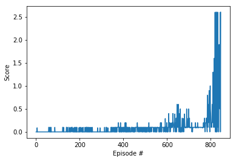

## Report
---
The aim of the project was to train a Deep Reinforcement Agent to solve the *_Udacity's Tennis Unity Env_* [(Windows x64 verion)](https://github.com/Unity-Technologies/ml-agents/blob/master/docs/Learning-Environment-Examples.md#tennis). 

For details on the nature of the environment see README.md

## Algorithm

The agent was trained using a `Deep Deterministic Policy Gradient` model using an `Actor-Critic` methodology. This was sufficient to solve the environment in 847 episodes meaning that the  average score for each episode was over 0.5.

## Model Architecture

The `DDPG` consists of two elements, the `Actor` and the `Critic`. These two have very similar architectures. 

`Actor`
The actor consists of 3 layers. 
* 2 fully connected layers with `ReLU` activation functions. 
* 1 fully connected output layer with a `Tanh` activation function. 

`Critic`
The critic has a similiar architecture to the actor. 
* 1 fully connected layer with a `ReLU` activation function. 
* The output of the 1st layer is concatenated with the `action` passed into the forward function. 
* A second fully connected layer with a `ReLU` activation function.
* A final fully concted output layer without an activation function

## Hyper Parameters  

####Training Parameters
```
BUFFER_SIZE = int(1e5)  # replay buffer size
BATCH_SIZE = 256        # minibatch size
GAMMA = 0.99            # discount factor
TAU = 1e-3              # for soft update of target parameters
UPDATE_EVERY = 2        # Udpate every
```

#### Agent Parameters
```
LR_ACTOR = 1e-4         # learning rate of the actor 
LR_CRITIC = 1e-4        # learning rate of the critic
WEIGHT_DECAY = 0        # L2 weight decay

JITTER_DECAY = 0.99     # rate of decay for noise
BEGIN_NOISE_AT = 500    # begin adding noise at 
JITTER_BEGIN_AT = 1.0   # initial noise rate
JITTER_END_AT = 0.1     # mim noise rate
```


## Learning Algorithm 
The `Agent` is trained using the ddpg training helper function in the `Tennis.ipynb`. The training happens in an episodic manner until the environment is natually solved or maximum number of epsiodes are completed. The environment is considered solved when the average reward over 100 episodes is at >=0.5.

###  Network
DDPG (Deep Deterministic Poliy Gradient) is an actor-critic approach as a learning algorithm. This works similarly to a DQN but with adjustmets to allow for continous spaces.

DDPG utilizes four networks: 
    - Local actor
    - Target actor
    - Local critic 
    - Target critic 

The reason for two networks for both the Actor and Critic is that the local version is updated at each episode whereas the target actor weights are held static for a stated number of episodes. This allows for a benchmark network to critique the actors actions and helps account for any occiliations that would be visible in an actor method alone.  

The actor tries to estimate the optimal policy by using the estimated state-action values from the critic while critic tries to estimate the optimal q-value function and learns by using a normal q-learning approach. Using this approach one gains the benefits of value based and policy based methods at the same time.

## Training Rewards


## Future Work
The agent could be improved by utilising a different learning algorithm. 

Examples of possible algorithms are:
    - PPO
    - AC3
    - D4PG
    
As well as using an improved memory method such as:
    - Prioritized Memory

OU Noise could also have been used to improve the network. 